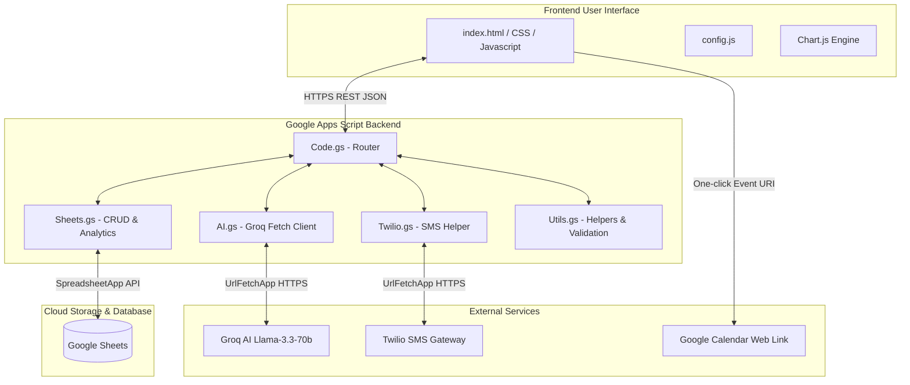

# RK Health System Architecture

This document describes the system architecture for **RK Health – AI Smart Patient Appointment & Medication Reminder System**.

The application is structured as a decoupled serverless-like system:
1. **Frontend Client**: A responsive single-page application built on HTML5, CSS3, and Vanilla ES6+ JavaScript. It communicates with the backend via HTTPS and JSON.
2. **Backend Server (API)**: Powered by Google Apps Script, deployed as a Web App. It exposes HTTP endpoints (`doGet` and `doPost`) to process database CRUD, trigger AI calls, interface with Twilio, and build event templates.
3. **Database Layer**: Google Sheets, serving as a structured tabular database.
4. **Third-Party APIs**:
   - **Groq API** (Llama 3.3 70B model) for AI clinical summaries.
   - **Twilio SMS API** for active patient text messages.
   - **Google Calendar API** (via dynamic URLs) to enable patients to add events to their calendars.

---

## Architecture Diagram

---

## Key Design Patterns & Guidelines

### 1. Separation of Concerns
The frontend client contains zero API keys or authentication secrets. All third-party credentials (Groq API, Twilio SID, Twilio Token) reside in the Google Apps Script environment.

### 2. State & Caching
The frontend client tracks active filters, date selections, and loaded lists in memory. Changes to the database trigger state updates on the frontend to maintain real-time sync.

### 3. Fallbacks and Offline Mock Mode
To allow full testing and offline operation without an active backend URL, the frontend features a toggleable Mock Mode in `config.js`. If set to `true`, local storage is used to mock sheet CRUD operations, and mock scripts simulate Groq API response structures and Twilio logs.
